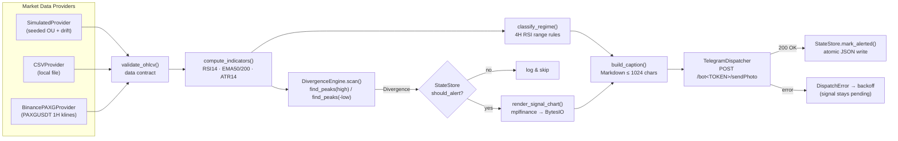

# 03 — Programmer Technical Manual

**Gold Trading & Compounding Accumulation System: Technical Specification & Implementation Guide**
Version 1.0.0 · Implementation: `04_GOLD_BOT_MONITOR_ENGINE.py` · Language: Python ≥ 3.9 (tested on 3.11)

---

## Table of Contents

1. [System Overview](#1-system-overview)
2. [Architecture & Data Pipeline](#2-architecture--data-pipeline)
3. [Data Contracts & DataFrame Schema](#3-data-contracts--dataframe-schema)
4. [Indicator Mathematics](#4-indicator-mathematics)
5. [Divergence Detection Engine](#5-divergence-detection-engine)
6. [Charting Engine (In-Memory)](#6-charting-engine-in-memory)
7. [Telegram Dispatcher](#7-telegram-dispatcher)
8. [State Management & Debounce](#8-state-management--debounce)
9. [Configuration Reference](#9-configuration-reference)
10. [Environment Setup & Dependencies](#10-environment-setup--dependencies)
11. [Deployment & Process Management](#11-deployment--process-management)
12. [Testing & Verification](#12-testing--verification)
13. [Operations Runbook](#13-operations-runbook)

---

## 1. System Overview

The engine is a **single-file, single-process polling daemon**. Every `POLL_SECONDS` it:

1. fetches the latest closed 1H OHLCV candles for gold;
2. validates them against a strict data contract;
3. computes Wilder RSI(14), EMA50, EMA200 and ATR(14), plus a 4H RSI regime;
4. scans for bearish and bullish RSI divergences with `scipy.signal.find_peaks`;
5. for each new, fresh, not-yet-alerted signal, renders a 60-candle chart **in memory** and sends it to Telegram with a Markdown caption;
6. persists a debounce key, so the same pivot is never alerted twice, even across restarts.

| Design principle | Implementation |
|---|---|
| Deterministic, testable core | Pure functions for indicators and detection; `--self-test` builds known-answer scenarios |
| No disk writes for charts | `mplfinance.plot(view, returnfig=True)` → `fig.savefig(io.BytesIO())` → bytes |
| Fail-safe loop | Typed exceptions (`DataError`, `DispatchError`) with exponential backoff; the daemon never exits on a bad cycle |
| At-least-once delivery | A debounce key is written **only after** a successful send; a failed send is retried next cycle while the signal is still fresh |
| Config via environment | 12-factor style; every field of `Config` has an environment variable |

---

## 2. Architecture & Data Pipeline

### 2.1 Component diagram (Mermaid)



### 2.2 Pipeline (ASCII)

```
┌──────────────┐   ┌───────────────┐   ┌──────────────────┐   ┌─────────────────────┐
│ OHLCV fetch  │──►│ validate_ohlcv│──►│ compute_indicators│──►│ DivergenceEngine    │
│ (provider)   │   │ tz=UTC, sort, │   │ rsi, ema_fast,   │   │  BEARISH: highs     │
│ 500 × 1H bars│   │ dedupe, H/L   │   │ ema_slow, atr    │   │  BULLISH: -lows     │
└──────────────┘   │ integrity     │   └────────┬─────────┘   │  freshness ≤ 3 bars │
                   └───────────────┘            │             └──────────┬──────────┘
                                                ▼                        │ List[Divergence]
                                     ┌──────────────────┐                ▼
                                     │ classify_regime  │     ┌──────────────────────┐
                                     │ 4H resample, RSI │     │ StateStore           │
                                     │ BULL/BEAR/TRANS  │     │ key = KIND:t2 (ISO)  │
                                     └────────┬─────────┘     │ + per-kind cooldown  │
                                              │               └──────────┬───────────┘
                                              ▼                          ▼ new signal
                         ┌──────────────────────────────┐    ┌──────────────────────┐
                         │ build_caption (Markdown)     │◄───│ render_signal_chart  │
                         │ price · signal · RSI · P/L   │    │ 60 bars, 2 panels    │
                         │ USD+THB · actions            │    │ PNG bytes (BytesIO)  │
                         └──────────────┬───────────────┘    └──────────┬───────────┘
                                        └──────────────┬────────────────┘
                                                       ▼
                                   ┌─────────────────────────────────────┐
                                   │ TelegramDispatcher.send_photo       │
                                   │ multipart/form-data → sendPhoto     │
                                   │ retry 429/5xx · Markdown fallback   │
                                   └──────────────────┬──────────────────┘
                                                      ▼
                                          StateStore.mark_alerted (atomic)
```

### 2.3 Module map (`04_GOLD_BOT_MONITOR_ENGINE.py`)

| Section | Symbols | Responsibility |
|---|---|---|
| Configuration | `Config`, `Config.from_env`, `Config.validate` | Immutable settings, env parsing, cross-field validation |
| Errors | `DataError`, `DispatchError` | Typed failures for the loop's backoff policy |
| Data contract | `validate_ohlcv` | Schema enforcement and normalisation |
| Providers | `SimulatedProvider`, `CSVProvider`, `BinancePAXGProvider`, `generate_simulated_ohlcv`, `build_divergence_scenario` | Market data |
| Indicators | `wilder_smooth`, `wilder_rsi`, `wilder_rsi_reference`, `ema`, `wilder_atr`, `compute_indicators`, `classify_regime` | Maths |
| Detection | `Divergence`, `DivergenceEngine` | Pivots, rules, freshness |
| Analytics | `PositionSnapshot` | P/L in USD and THB, target prices |
| Charting | `render_signal_chart`, `CHART_STYLE` | In-memory PNG |
| Messaging | `build_caption`, `recommended_actions`, `md_escape`, `TelegramDispatcher` | Telegram |
| State | `StateStore` | Debounce and cooldown persistence |
| Orchestration | `GoldMonitorBot.run_cycle`, `run_forever` | Loop, signals, backoff |
| Verification | `run_self_test` | Known-answer tests |
| CLI | `build_arg_parser`, `main` | Entry point |

---

## 3. Data Contracts & DataFrame Schema

### 3.1 Raw OHLCV frame (provider output → `validate_ohlcv` input)

| Element | Type | Constraint |
|---|---|---|
| Index | `pd.DatetimeIndex` | Candle **open** time. Naive values are treated as UTC; aware values are converted to UTC. Name: `timestamp` |
| `open` | `float64` | > 0 |
| `high` | `float64` | ≥ max(`open`, `close`) |
| `low` | `float64` | ≤ min(`open`, `close`) |
| `close` | `float64` | > 0 |
| `volume` | `float64` | ≥ 0. May be 0 for sources without volume (CSV fills 0 if the column is absent) |

**Normalisation performed by `validate_ohlcv`:** columns are cast to `float64` and reordered to `open, high, low, close, volume`; the index is converted to UTC; duplicate timestamps are dropped (last wins); rows are sorted ascending.

**Rejections (raise `DataError`):** any NaN; any non-positive price; high/low that do not bracket open/close (1e-9 tolerance); fewer than `MIN_BARS` (default 250) rows; non-DatetimeIndex; missing columns.

**Closed-candle rule:** providers must return **closed candles only**. `BinancePAXGProvider` drops any kline whose close time (`r[6]`) is in the future. A still-forming candle would repaint pivots and break the freshness semantics.

### 3.2 Indicator frame (`compute_indicators` output)

| Column | dtype | Definition | First valid row (0-based) |
|---|---|---|---|
| `open`,`high`,`low`,`close`,`volume` | float64 | As above | 0 |
| `rsi` | float64 | Wilder RSI(`RSI_PERIOD`=14), range [0, 100] | 14 |
| `ema_fast` | float64 | EMA(`EMA_FAST`=50), `adjust=False` | 0 (warm-up bias until ≈ 3×span) |
| `ema_slow` | float64 | EMA(`EMA_SLOW`=200), `adjust=False` | 0 (warm-up bias until ≈ 3×span) |
| `atr` | float64 | Wilder ATR(`ATR_PERIOD`=14) | 13 |

Example (tail of the self-test BULLISH scenario, rounded to 2 dp):

```
timestamp (UTC)             open      high      low       close     volume  rsi    ema_fast  ema_slow  atr
2026-09-24 08:00:00+00:00   4243.04   4245.23   4237.79   4239.13   1374.0  32.68  4271.45   4286.41   7.14
2026-09-24 09:00:00+00:00   4239.13   4244.89   4238.54   4244.42   1961.0  37.49  4270.39   4285.99   7.08
2026-09-24 10:00:00+00:00   4244.42   4250.50   4243.51   4249.72   1944.0  41.97  4269.58   4285.63   7.08
```

### 3.3 `Divergence` record

| Field | Type | Meaning |
|---|---|---|
| `kind` | `str` | `"BEARISH"` or `"BULLISH"` |
| `idx1`, `idx2` | `int` | Positional indices of the price pivots (older, newer) |
| `t1`, `t2` | `pd.Timestamp` (UTC) | Pivot candle times |
| `price1`, `price2` | `float` | `high` (bearish) or `low` (bullish) at the pivots |
| `rsi_idx1`, `rsi_idx2`, `rsi_t1`, `rsi_t2` | `int`, `Timestamp` | Location of the RSI extreme within ±`RSI_PIVOT_WINDOW` bars of each price pivot |
| `rsi1`, `rsi2` | `float` | RSI extreme values |
| `bars_since_pivot` | `int` | `last_index − idx2` (1 to `FRESHNESS_BARS`) |
| `key` (property) | `str` | `f"{kind}:{t2.isoformat()}"`, the debounce identity |

### 3.4 State file (`STATE_PATH`, JSON, UTF-8)

```json
{
  "alerted": {
    "BULLISH:2026-09-24T08:00:00+00:00": "2026-09-24T10:05:00+00:00"
  },
  "last_by_kind": {
    "BULLISH": "2026-09-24T10:05:00+00:00"
  },
  "version": "1.0.0"
}
```

`alerted` maps debounce key → send time. Entries older than `STATE_RETENTION_DAYS` (14) are pruned on each write.

### 3.5 CSV input format (`DATA_SOURCE=csv`)

```csv
timestamp,open,high,low,close,volume
2026-09-24 08:00:00+00:00,4243.10,4244.52,4237.79,4239.02,1187
2026-09-24 09:00:00+00:00,4239.02,4246.40,4238.61,4245.31,1203
```

The timestamp column may be named `timestamp`, `datetime`, `date` or `time` (case-insensitive). `volume` is optional.

---

## 4. Indicator Mathematics

### 4.1 Wilder's RSI (14 periods)

Let `C_t` be the close at bar `t`, and `n = 14`.

**Step 1: price change, gains and losses**

$$\Delta_t = C_t - C_{t-1}, \qquad G_t = \max(\Delta_t, 0), \qquad L_t = \max(-\Delta_t, 0)$$

**Step 2: seed with a simple average** of the first `n` changes (bars 1 to n):

$$\overline{G}_n = \frac{1}{n}\sum_{i=1}^{n} G_i, \qquad \overline{L}_n = \frac{1}{n}\sum_{i=1}^{n} L_i$$

**Step 3: Wilder smoothing (RMA)** for `t > n`:

$$\overline{G}_t = \frac{(n-1)\,\overline{G}_{t-1} + G_t}{n} = \overline{G}_{t-1} + \frac{1}{n}\left(G_t - \overline{G}_{t-1}\right)$$

This is exactly an **exponential moving average with smoothing factor α = 1/n** (not the usual `2/(n+1)`), seeded by the SMA. In pandas: `series.ewm(alpha=1/n, adjust=False).mean()`, applied to a series whose first valid value is the SMA seed.

**Step 4: RSI**

$$RS_t = \frac{\overline{G}_t}{\overline{L}_t}, \qquad RSI_t = 100 - \frac{100}{1 + RS_t}$$

Edge cases: `L̄ = 0 and Ḡ > 0 → RSI = 100`; `L̄ = Ḡ = 0 → RSI = 50`; undefined (NaN) before bar `n`.

**Pseudocode (vectorised, as implemented):**

```python
def wilder_smooth(values, n, skip_first=True):
    start    = 1 if skip_first else 0          # element 0 of diff() is NaN
    seed_idx = start + n - 1                   # = n for RSI, n-1 for ATR
    seeded   = full(len(values), NaN)
    seeded[seed_idx]      = mean(values[start : seed_idx + 1])   # SMA seed
    seeded[seed_idx + 1:] = values[seed_idx + 1:]                # raw inputs after seed
    return Series(seeded).ewm(alpha=1/n, adjust=False).mean()    # RMA recursion

def wilder_rsi(close, n=14):
    delta    = close.diff()
    avg_gain = wilder_smooth(delta.clip(lower=0), n)
    avg_loss = wilder_smooth((-delta).clip(lower=0), n)
    rsi      = 100 - 100 / (1 + avg_gain / avg_loss)
    rsi[avg_loss == 0] = 100
    rsi[(avg_gain == 0) & (avg_loss == 0)] = 50
    return rsi
```

Why this is exact: with `adjust=False`, pandas computes `y_t = (1−α)·y_{t−1} + α·x_t` and starts from the first non-NaN value. Setting that first value to the SMA seed reproduces Wilder's recursion to floating-point precision. `--self-test` checks it against the textbook loop `wilder_rsi_reference` with tolerance `1e-9`.

### 4.2 EMA 50 / 200

$$EMA_t = \alpha\,C_t + (1-\alpha)\,EMA_{t-1}, \qquad \alpha = \frac{2}{\text{span}+1}$$

`close.ewm(span=span, adjust=False).mean()`. With 500 bars of history, EMA200 has had 2.5 spans to converge, which leaves residual seed influence of `(1−α)^300 ≈ 5%` at the last bar. For stricter convergence, raise `HISTORY_BARS` (Binance allows up to 1000).

### 4.3 ATR(14) (used for pivot prominence)

$$TR_t = \max(H_t - L_t,\ |H_t - C_{t-1}|,\ |L_t - C_{t-1}|), \qquad ATR = \text{RMA}_{14}(TR)$$

### 4.4 4H regime (Cardwell / Brown range rules)

```python
four_h = df.resample("4h", label="left", closed="left").agg(open=first, high=max, low=min, close=last)
rsi4 = wilder_rsi(four_h.close, 14).dropna()
window = rsi4[-30:]
regime = "BULL_RANGE" if window.min() >= 40 else "BEAR_RANGE" if window.max() <= 60 else "TRANSITION"
trend_1h = "UPTREND"   if ema50 > ema200 and close > ema50 else \
           "DOWNTREND" if ema50 < ema200 and close < ema50 else "MIXED"
```

---

## 5. Divergence Detection Engine

### 5.1 Pivot detection with `scipy.signal.find_peaks`

`find_peaks(x, distance=d, prominence=p)` returns indices `i` where `x[i]` is a strict local maximum. Peaks closer than `d` samples are thinned (the higher one survives), and each peak must rise at least `p` above its surrounding bases.

| Direction | Input array | What it finds |
|---|---|---|
| Bearish (highs) | `x = high` | Swing highs |
| Bullish (lows) | `x = -low` (**array inversion**) | Swing lows, because minima of `low` are maxima of `-low` |

Parameters:

- `distance = PIVOT_DISTANCE` (5 bars)
- `prominence = PIVOT_PROMINENCE_ATR × median(ATR14 over last 100 bars)` (0.6 × ATR). Scaling by ATR keeps the pivot filter volatility-adaptive, so a $2 wiggle is noise when ATR is $10 but meaningful when ATR is $3.

**Confirmation property:** `find_peaks` never returns the last element (it has no right neighbour). A pivot at index `i` therefore needs at least one later bar with a lower high (or higher low), so every reported pivot is confirmed by at least one closed candle.

### 5.2 Rules

For the newest pivot `p2` and each earlier pivot `p1`, scanning backwards with `MIN_PIVOT_GAP (5) ≤ p2 − p1 ≤ MAX_PIVOT_GAP (40)`, the first `p1` that satisfies all conditions produces the signal:

| Rule | Bearish divergence | Bullish divergence |
|---|---|---|
| Price structure | `price2 >= price1 * 0.999` (higher / equal high) | `price2 <= price1 * 1.001` (lower / equal low) |
| RSI structure | `rsi2 < rsi1` (lower high) | `rsi2 > rsi1` (higher low) |
| RSI zone (current) | `rsi2 >= 55.0` | `rsi2 <= 35.0` |
| RSI zone (prior) | — | `rsi1 < 30.0` |
| Freshness | `1 <= (n-1) - p2 <= 3` | same |
| RSI sample | `max(rsi[p-2 : p+2])` | `min(rsi[p-2 : p+2])` |

The RSI value is taken as the extreme within ±`RSI_PIVOT_WINDOW` (2) bars of the price pivot, clipped to the last closed bar. RSI peaks often lead or lag the price peak by a bar.

### 5.3 Pseudocode

```python
def detect(df, kind):                        # kind in {"BEARISH", "BULLISH"}
    is_bear = kind == "BEARISH"
    series  = df.high.values if is_bear else -df.low.values      # inversion for troughs
    prom    = 0.6 * median(df.atr[-100:])
    pivots, _ = find_peaks(series, distance=5, prominence=prom)
    pivots  = [p for p in pivots if not isnan(df.rsi[p])]
    if len(pivots) < 2: return None

    last = len(df) - 1
    p2   = pivots[-1]
    if not (1 <= last - p2 <= 3):            # freshness filter
        return None

    prices = df.high.values if is_bear else df.low.values
    r2_idx, r2 = rsi_extreme(p2, window=2, use_max=is_bear)

    for p1 in reversed(pivots[:-1]):
        gap = p2 - p1
        if gap < 5:  continue
        if gap > 40: break
        r1_idx, r1 = rsi_extreme(p1, window=2, use_max=is_bear)
        if is_bear:
            ok = prices[p2] >= prices[p1] * 0.999 and r2 < r1 and r2 >= 55.0
        else:
            ok = (prices[p2] <= prices[p1] * 1.001 and r2 > r1
                  and r2 <= 35.0 and r1 < 30.0)
        if ok:
            return Divergence(kind=kind, idx1=p1, idx2=p2,
                              price1=prices[p1], price2=prices[p2],
                              rsi_idx1=r1_idx, rsi_idx2=r2_idx, rsi1=r1, rsi2=r2,
                              bars_since_pivot=last - p2)
    return None

def scan(df):
    return [s for s in (detect(df, "BULLISH"), detect(df, "BEARISH")) if s]
```

### 5.4 Complexity

`find_peaks` is O(n). The backward pair scan is bounded by `MAX_PIVOT_GAP / PIVOT_DISTANCE ≈ 8` candidates. A full cycle on ~320–500 bars (validation, indicators, 4H regime, both scans) runs in about 20 ms. Chart rendering (~0.3 s) dominates, and it only runs when a signal fires.

---

## 6. Charting Engine (In-Memory)

```python
view = df_ind.iloc[-60:]                       # CHART_BARS
view.index = view.index.tz_convert("Asia/Bangkok").tz_localize(None)   # local, naive for mpf

apds = [
    make_addplot(view.ema_fast, panel=0, color="#1e88e5"),
    make_addplot(view.ema_slow, panel=0, color="#8e24aa"),
    make_addplot(view.rsi,      panel=1, ylim=(0, 100), ylabel="RSI 14"),
    # dashed reference levels on the RSI panel: 30, 35, 55, 70
    *[make_addplot(Series(level, index=view.index), panel=1, linestyle="--", ylim=(0, 100))
      for level in (30, 35, 55, 70)],
    # RSI divergence trendline: NaN series with a linear segment rsi1 -> rsi2
    make_addplot(rsi_line, panel=1, color=div_color, width=2.0, ylim=(0, 100)),
]
fig, axes = mpf.plot(view, type="candle", style=CHART_STYLE, addplot=apds,
                     alines=dict(alines=[[(t1, price1), (t2, price2)]], colors=[div_color]),
                     hlines=dict(hlines=[entry_price], linestyle="-."),     # only if a position is set
                     panel_ratios=(3, 1.3), returnfig=True)
buf = io.BytesIO()
fig.savefig(buf, format="png", dpi=110, bbox_inches="tight")
plt.close(fig)                                  # prevents figure leaks in a long-running daemon
png_bytes = buf.getvalue()
```

Implementation notes:

- **The RSI-panel horizontal lines are constant-valued `make_addplot` series with `linestyle="--"`.** mplfinance's `hlines=` keyword draws on the **main (price) panel only**, so it is used there for the entry-price line. The dashed 30/35/55/70 lines therefore need addplots.
- **The RSI divergence trendline** is also an addplot, because `alines=` only targets panel 0.
- **Backend:** `matplotlib.use("Agg")` is set before importing pyplot, so the daemon runs headless.
- **Style:** teal/red candles (`#26a69a` / `#ef5350`), `charles` base, dotted light grid, white background.
- A chart is ~100 KB PNG at 110 dpi, well below Telegram's 10 MB photo limit.

---

## 7. Telegram Dispatcher

**Endpoint:** `POST https://api.telegram.org/bot<TOKEN>/sendPhoto` as `multipart/form-data`:

| Part | Value |
|---|---|
| `chat_id` | `TELEGRAM_CHAT_ID` (user id, group id starting with `-100`, or `@channel`) |
| `photo` | `("gold_signal.png", <bytes>, "image/png")` |
| `caption` | Markdown text, ≤ 1024 characters |
| `parse_mode` | `Markdown` (legacy) |

**Retry policy:**

| Response | Behaviour |
|---|---|
| 200 | Success → `StateStore.mark_alerted` |
| 400 containing "parse" | Resend immediately as plain text (Markdown stripped) |
| 429 | Sleep `parameters.retry_after` seconds, retry |
| 5xx / network error | Exponential backoff 2 s, 4 s, 8 s, up to 4 attempts |
| Other 4xx (401, 403, 404) | Raise `DispatchError` immediately (configuration problem) |

**Caption structure** (actual self-test output; legacy Markdown; dynamic text is escaped by `md_escape` for `_ * \` [`):

```
🟢 *BULLISH DIVERGENCE - ENTRY WATCH*
*XAU/USD* · 1H · `24 Sep 2026 17:00 Asia/Bangkok`
━━━━━━━━━━━━━━━━
*Price:* `$4,249.72`
*Signal:* Bullish RSI(14) divergence
Price lower low `$4,249.52 → $4,237.79`
RSI higher low `20.3 → 31.9`
*RSI(14) now:* `42.0` · pivot 2 bar(s) ago
*EMA50/200:* `$4,269.58 / $4,285.63` (DOWNTREND)
*4H regime:* TRANSITION (RSI4H `36.6`)
━━━━━━━━━━━━━━━━
*Position:* 0.10 oz @ `$4,262.52`
*P/L:* `-$1.28` | `-41.59 THB` (-0.30%)
━━━━━━━━━━━━━━━━
*Action:*
1. HOLD the physical position. Do NOT sell into RSI < 30 - the wallet has no margin call.
2. Averaging is allowed ONLY if it was pre-planned; never exceed your max allocation.
3. 4H regime is in transition: size small and respect the +1.0% first target.
4. Targets: +1.0% $4,305.15 | +1.5% $4,326.46 | +2.0% $4,347.77
_Not financial advice._
```

If a caption ever exceeds 1024 characters, action lines are dropped from the end (header, prices and P/L are preserved) and the result is hard-truncated as a last resort.

**Getting credentials:** create a bot with **@BotFather** (`/newbot`) to get the token. Send the bot a message, then open `https://api.telegram.org/bot<TOKEN>/getUpdates` and read `message.chat.id`. For a channel, add the bot as an administrator and use `@channelname` or the numeric id that starts with `-100`.

---

## 8. State Management & Debounce

| Mechanism | Purpose |
|---|---|
| **Pivot key** `KIND:t2` | A divergence stays "fresh" for up to 3 candles and is re-detected on every poll (60 per hour). The key makes it alert exactly once |
| **Per-kind cooldown** (`ALERT_COOLDOWN_MINUTES`=180) | Suppresses a *new* pivot of the same direction arriving shortly after the last alert (choppy markets) |
| **Mark after send** | If Telegram fails, the key is not stored, so the next cycle retries while the signal is still fresh |
| **Atomic persistence** | `tempfile.mkstemp` in the same directory → `json.dump` → `os.replace` (atomic on POSIX), so a crash never leaves a half-written file |
| **Corruption tolerance** | An unreadable state file is logged and replaced with empty state (worst case: one duplicate alert) |
| **Retention** | Keys older than 14 days are pruned on write |
| **Thread safety** | A `threading.Lock` guards reads and writes (the daemon is single-threaded; the lock protects future extensions) |

---

## 9. Configuration Reference

| Env var | CLI flag | Default | Description |
|---|---|---|---|
| `TELEGRAM_BOT_TOKEN` | — | *(empty)* | Bot token. Empty → dry-run logging |
| `TELEGRAM_CHAT_ID` | — | *(empty)* | Destination chat |
| `DRY_RUN` | `--dry-run` | `false` | Never call Telegram; log captions |
| `DATA_SOURCE` | `--source` | `simulated` | `simulated` \| `csv` \| `binance_paxg` |
| `CSV_PATH` | `--csv` | `gold_1h.csv` | CSV source path |
| `SYMBOL_LABEL` | — | `XAU/USD` | Label on chart and caption |
| `HISTORY_BARS` | — | `500` | Bars fetched per cycle |
| `MIN_BARS` | — | `250` | Minimum bars required (≥ `EMA_SLOW`) |
| `POLL_SECONDS` | `--poll-seconds` | `60` | Seconds between cycles |
| `REQUEST_TIMEOUT` | — | `15` | HTTP timeout (s) |
| `SIM_SEED` / `SIM_START_PRICE` | — | `20260924` / `4300` | Simulator seed and start price |
| `POSITION_OZ` | `--position-oz` | `0.10` | Open position size (oz) |
| `ENTRY_PRICE` | `--entry-price` | *(unset)* | Average entry (USD/oz). Unset = no position |
| `USD_THB` | `--usd-thb` | `32.50` | FX for THB P/L |
| `PROFIT_TARGETS_PCT` | — | `1.0,1.5,2.0,3.0` | Target ladder |
| `RSI_PERIOD` / `EMA_FAST` / `EMA_SLOW` / `ATR_PERIOD` | — | `14` / `50` / `200` / `14` | Indicator periods |
| `PIVOT_DISTANCE` | — | `5` | `find_peaks` distance |
| `PIVOT_PROMINENCE_ATR` | — | `0.6` | Prominence as a multiple of median ATR |
| `MIN_PIVOT_GAP` / `MAX_PIVOT_GAP` | — | `5` / `40` | Allowed bars between pivots |
| `RSI_PIVOT_WINDOW` | — | `2` | ± bars to locate the RSI extreme |
| `FRESHNESS_BARS` | — | `3` | Max bars since the second pivot |
| `BEAR_RSI_MIN` | — | `55.0` | Bearish second-peak floor |
| `BULL_RSI_MAX` / `BULL_PRIOR_RSI_MAX` | — | `35.0` / `30.0` | Bullish trough ceilings |
| `CHART_BARS` / `CHART_DPI` | — | `60` / `110` | Chart window and resolution |
| `DISPLAY_TZ` | — | `Asia/Bangkok` | Chart and caption time zone |
| `STATE_PATH` | `--state-file` | `gold_bot_state.json` | Debounce state file |
| `ALERT_COOLDOWN_MINUTES` | — | `180` | Per-direction cooldown |
| `STATE_RETENTION_DAYS` | — | `14` | Key retention |
| `MAX_BACKOFF_SECONDS` | — | `900` | Loop backoff ceiling |
| `LOG_LEVEL` | `--log-level` | `INFO` | Logging level |

`Config.validate()` rejects inconsistent combinations at startup (exit code 2). For example, `CHART_BARS` must exceed `MAX_PIVOT_GAP + FRESHNESS_BARS + 2·RSI_PIVOT_WINDOW` so both pivots are always visible on the chart.

---

## 10. Environment Setup & Dependencies

### 10.1 Dependencies

| Package | Tested version | Role |
|---|---|---|
| `requests` | 2.33.1 | HTTP (Telegram, Binance) |
| `pandas` | 3.0.6 | DataFrames, EWM, resampling |
| `numpy` | 2.4.6 | Arrays |
| `scipy` | 1.17.1 | `scipy.signal.find_peaks` |
| `mplfinance` | 0.12.10b0 | Candlestick charting (pulls in `matplotlib` 3.11.2) |

Standard library only otherwise (`zoneinfo` requires Python ≥ 3.9; on minimal images install the `tzdata` package).

### 10.2 Local setup

```bash
python3 -m venv .venv
source .venv/bin/activate
pip install --upgrade pip
pip install "requests>=2.31" "pandas>=2.0" "numpy>=1.24" "scipy>=1.10" "mplfinance>=0.12.10b0" tzdata

python 04_GOLD_BOT_MONITOR_ENGINE.py --self-test          # must print SELF-TEST PASSED
python 04_GOLD_BOT_MONITOR_ENGINE.py --once --dry-run     # one simulated cycle
```

### 10.3 Secrets file (`/etc/gold-bot/gold-bot.env`, mode `0600`)

```ini
TELEGRAM_BOT_TOKEN=123456789:AAExampleTokenValueFromBotFather
TELEGRAM_CHAT_ID=987654321
DATA_SOURCE=binance_paxg
POSITION_OZ=0.10
ENTRY_PRICE=4319
USD_THB=32.50
STATE_PATH=/var/lib/gold-bot/gold_bot_state.json
LOG_LEVEL=INFO
```

Never commit this file. Rotate the token with @BotFather (`/revoke`) if it leaks.

### 10.4 Data source notes

| Source | Pros | Cons |
|---|---|---|
| `simulated` | Offline and deterministic; good for demos and CI | Not real prices |
| `csv` | Any vendor (MT5 export, broker API dumps) | You must refresh the file yourself (cron/ETL) |
| `binance_paxg` | Free, keyless, real 24/7 1H candles | PAXG is a tokenised-gold proxy: tracks XAU/USD closely but can deviate by a small premium/discount and trades on weekends when spot gold is closed. Some networks and jurisdictions block `api.binance.com` |

To add a provider, implement a class with `fetch() -> pd.DataFrame` that returns closed candles per §3.1, and register it in `build_provider`.

---

## 11. Deployment & Process Management

### 11.1 systemd (recommended on a VPS)

`/etc/systemd/system/gold-bot.service`:

```ini
[Unit]
Description=Gold RSI Divergence Monitor (Telegram)
After=network-online.target
Wants=network-online.target

[Service]
Type=simple
User=goldbot
Group=goldbot
WorkingDirectory=/opt/gold-bot
EnvironmentFile=/etc/gold-bot/gold-bot.env
ExecStart=/opt/gold-bot/.venv/bin/python /opt/gold-bot/04_GOLD_BOT_MONITOR_ENGINE.py
Restart=always
RestartSec=10
KillSignal=SIGTERM
TimeoutStopSec=30
StateDirectory=gold-bot
NoNewPrivileges=true
ProtectSystem=strict
ProtectHome=true
PrivateTmp=true
ReadWritePaths=/var/lib/gold-bot

[Install]
WantedBy=multi-user.target
```

```bash
sudo useradd --system --home /opt/gold-bot --shell /usr/sbin/nologin goldbot
sudo mkdir -p /opt/gold-bot /etc/gold-bot
sudo cp 04_GOLD_BOT_MONITOR_ENGINE.py /opt/gold-bot/
sudo python3 -m venv /opt/gold-bot/.venv
sudo /opt/gold-bot/.venv/bin/pip install requests pandas numpy scipy mplfinance tzdata
sudo chown -R goldbot:goldbot /opt/gold-bot
sudo chmod 600 /etc/gold-bot/gold-bot.env
sudo systemctl daemon-reload
sudo systemctl enable --now gold-bot
journalctl -u gold-bot -f                 # live logs
```

The engine handles `SIGTERM` gracefully: it finishes the current cycle and exits within one wait interval.

### 11.2 Docker

`Dockerfile`:

```dockerfile
FROM python:3.11-slim
ENV PYTHONDONTWRITEBYTECODE=1 PYTHONUNBUFFERED=1 MPLCONFIGDIR=/tmp/mpl
RUN pip install --no-cache-dir requests pandas numpy scipy mplfinance tzdata \
 && useradd --create-home --uid 10001 goldbot \
 && mkdir -p /data && chown goldbot:goldbot /data
WORKDIR /app
COPY 04_GOLD_BOT_MONITOR_ENGINE.py /app/
USER goldbot
ENV STATE_PATH=/data/gold_bot_state.json
ENTRYPOINT ["python", "/app/04_GOLD_BOT_MONITOR_ENGINE.py"]
```

```bash
docker build -t gold-bot:1.0.0 .
docker run --rm gold-bot:1.0.0 --self-test
docker run -d --name gold-bot --restart unless-stopped \
  --env-file /etc/gold-bot/gold-bot.env \
  -v gold-bot-data:/data \
  gold-bot:1.0.0
docker logs -f gold-bot
```

`docker stop` sends `SIGTERM`, which the daemon handles. The named volume keeps debounce state across container rebuilds.

### 11.3 tmux (quick manual runs / development)

```bash
tmux new -s goldbot
source .venv/bin/activate
set -a; source ./gold-bot.env; set +a
python 04_GOLD_BOT_MONITOR_ENGINE.py 2>&1 | tee -a gold-bot.log
# detach: Ctrl-b d      reattach: tmux attach -t goldbot      stop: Ctrl-c (SIGINT, graceful)
```

tmux does **not** restart the process after a crash or reboot. Use it for development only, and systemd or Docker in production.

### 11.4 Comparison

| Criterion | systemd | Docker | tmux |
|---|---|---|---|
| Auto-restart on crash | ✔ `Restart=always` | ✔ `--restart unless-stopped` | ✘ |
| Start on boot | ✔ | ✔ (daemon enabled) | ✘ |
| Log management | journald | `docker logs` / drivers | Manual `tee` |
| Isolation | Sandboxing directives | Container | None |
| Best for | Single VPS | Portable / multi-host | Development |

---

## 12. Testing & Verification

### 12.1 Built-in self-test

```bash
python 04_GOLD_BOT_MONITOR_ENGINE.py --self-test ; echo "exit=$?"
```

| Check | Assertion |
|---|---|
| RSI exactness | Vectorised RSI equals the loop reference within `1e-9` |
| RSI warm-up | NaN for bars 0–13, defined from bar 14 |
| RSI bounds | All values in [0, 100] |
| Data contract | Simulated history passes `validate_ohlcv` |
| Bullish scenario | Detects BULLISH; no false BEARISH; `price2 ≤ price1·1.001`, `rsi2 > rsi1`, `rsi2 ≤ 35`, `rsi1 < 30` |
| Bearish scenario | Detects BEARISH; no false BULLISH; `price2 ≥ price1·0.999`, `rsi2 < rsi1`, `rsi2 ≥ 55` |
| Freshness | `1 ≤ bars_since_pivot ≤ 3`; an unconfirmed pivot (no closing candle after it) is not signalled |
| Chart | Output is a valid PNG (signature check, > 20 KB) |
| Caption | ≤ 1024 characters; includes USD and THB P/L |
| Debounce | A second cycle on identical data dispatches nothing |
| Walk-forward (informational) | Counts unique signals over 1,250 simulated bars |

Exit code `0` = pass, `1` = failure (suitable for CI and for `docker run --rm gold-bot:1.0.0 --self-test` as a deployment gate).

### 12.2 Importing the module in your own tests

The filename starts with a digit, so import it with `importlib`:

```python
import importlib.util, sys
spec = importlib.util.spec_from_file_location("gold_bot", "04_GOLD_BOT_MONITOR_ENGINE.py")
gold_bot = importlib.util.module_from_spec(spec)
sys.modules["gold_bot"] = gold_bot          # required for dataclasses
spec.loader.exec_module(gold_bot)

df  = gold_bot.build_divergence_scenario("BEARISH")
cfg = gold_bot.Config()
ind = gold_bot.compute_indicators(gold_bot.validate_ohlcv(df, cfg.min_bars), cfg)
assert gold_bot.DivergenceEngine(cfg).detect(ind, "BEARISH") is not None
```

### 12.3 Backtesting the signal set

Replay history bar by bar (`df.iloc[:end]` for increasing `end`) and call `DivergenceEngine.scan`. De-duplicate on `Divergence.key`. That is exactly what the live loop sees, so the backtest has no look-ahead: pivots are confirmed only by bars that have closed by `end`.

---

## 13. Operations Runbook

| Symptom | Likely cause | Resolution |
|---|---|---|
| `Telegram HTTP 401: Unauthorized` | Wrong or revoked token | Re-issue with @BotFather; update the env file; restart |
| `Telegram HTTP 400: chat not found` | Wrong `TELEGRAM_CHAT_ID`, or the user never messaged the bot | Send `/start` to the bot; re-read `getUpdates` |
| `Telegram HTTP 403: bot was blocked` | The user blocked the bot | Unblock it in Telegram |
| `Data/network problem: <error>. Retrying in <N>s.` repeating | Source unreachable / rate-limited | The loop backs off to at most 900 s automatically; check connectivity or switch source |
| `Need at least 250 bars` | Short CSV / new symbol | Provide more history or lower `MIN_BARS` (must stay ≥ `EMA_SLOW`) |
| Duplicate alerts after redeploy | State file not persisted | Mount a volume (Docker) or use `StateDirectory` (systemd) |
| No alerts for days | Normal in steady trends; or the source is stale | Check that the timestamp in the log's `Bar <timestamp> close=` line advances hourly |
| `Invalid configuration` at start (exit 2) | Inconsistent parameters | Read the listed errors; fix env vars |

**Log line reference:**

```
2026-09-24 10:05:00 INFO    gold_bot: Bar 2026-09-24T10:00:00+00:00 close=4249.72 RSI=41.97 EMA50=4269.58 EMA200=4285.63 4H=TRANSITION
2026-09-24 10:05:00 INFO    gold_bot: Signal BULLISH:2026-09-24T08:00:00+00:00 price 4249.52->4237.79 RSI 20.3->31.9
2026-09-24 10:05:01 INFO    gold_bot: Telegram alert delivered (attempt 1).
```

---

*End of Manual 03.*
